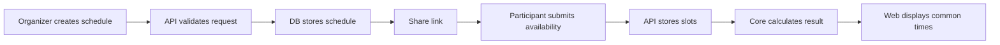
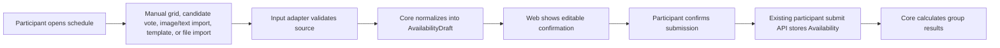
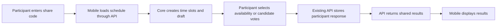

# 架构说明

## 架构目标

- 保持第一版简单，支持快速上线。
- 把核心业务逻辑和界面分离，便于未来复用到微信小程序。
- 所有关键规则有测试保护。
- 每次数据库、API、权限和时间规则变更都有明确记录。

## 推荐技术栈

第一阶段建议：

- 语言：TypeScript。
- Web：Next.js + React。
- 样式：Tailwind CSS 或项目内统一 CSS 方案，二选一后不混用。
- 数据库：Postgres。
- ORM：Drizzle。
- 时间处理：Luxon。
- 测试：Vitest。
- 部署：海外优先 Vercel 或 Cloudflare Pages。

微信小程序阶段：

- 小程序前端：原生微信小程序、Taro 或 uni-app，需在开始前写 ADR 决策。
- 后端：复用 Web 阶段 API。
- 核心算法：复用 `packages/core`。

## 目录结构

```text
apps/
  mobile/             # Expo + React Native 手机客户端（ADR 0010）
  web/
    src/
      app/
      components/
      features/
      lib/
packages/
  core/
    src/
      time/
      availability/
      domain/
    tests/
  db/
    src/
    migrations/
  api-client/
    src/
docs/
  adr/
```

手机端在 `apps/mobile` 使用原生 React Native 组件，通过 `packages/api-client` 调用现有 API，并从 `packages/core` 生成和规范化时间格。Firebase 只保存手机用户自己的资料与最近加入日程列表；共享日程、参与者可用时间和结果仍只由现有 API + Postgres 管理。详见 `docs/adr/0010-mobile-client.md`。

### `apps/mobile`

负责 Expo Router 页面、移动端输入交互和本机用户体验。日程读取、参与者提交和编辑都走现有 API；时间格与提交草稿沿用 `packages/core`。AsyncStorage 保存本机资料、房间索引和草稿，Expo SecureStore 保存参与者编辑密钥和组织者管理密钥。可选 Firebase 匿名认证只同步用户自己的资料和房间索引，不复制共享日程或参与者数据。

当前 MVP 支持创建开放网格或候选时间日程、组织者锁定/归档/确认最终时间、分享日程、通过分享码或粘贴链接加入、开放网格填写、候选时间三态投票、提交或更新回应和查看 API 返回的共享结果。普通 HTTPS 分享链接尚不能直接唤起已安装的 App；需要用户在 App 内粘贴链接或输入日程码。真机验收已于 2026-10-08 完成；检查项见 `apps/mobile/README.md`。

## 模块边界

### `packages/core`

负责纯业务逻辑，不依赖具体 UI、数据库或 Web 框架。

包含：

- 时间格生成。
- 时区转换策略。
- 可用时间交集计算。
- 忙碌时间块反推出可用时间建议。
- 长期模板投影到具体日程时间格。
- 多种添加方式归一化为可用时间草稿。
- 多数人空闲排序。
- 领域校验规则。

禁止：

- 访问数据库。
- 调用 HTTP。
- 读取浏览器 API。
- 引入 React 组件。

### `packages/db`

负责数据库 schema、migration 和数据库访问的基础封装。

包含：

- 表结构。
- migration。
- 数据库类型。
- 基础 repository。

禁止：

- 写 UI 逻辑。
- 重复实现排期算法。

### `packages/api-client`

负责前端访问后端 API 的类型安全封装。

包含：

- 请求函数。
- API 返回类型。
- 错误类型映射。

禁止：

- 直接操作数据库。
- 重复实现业务规则。

### `apps/web`

负责网页版用户体验。

包含：

- 页面路由。
- 表单和交互。
- 结果展示。
- 移动端适配。

禁止：

- 在组件里实现核心排期算法。
- 直接访问数据库，除非处于明确的服务端 API 或 server action 边界。

## 数据流



Web 端多种添加方式的数据流，产品规格见 `docs/availability-entry-methods.md`：



移动端参与者流程复用同一 API 和领域逻辑：



## 测试策略

必须优先测试：

- 时间格生成。
- UTC 和本地时区转换。
- 夏令时边界。
- 参与者提交覆盖规则。
- 所有人都有空的计算。
- 多数人空闲排序。
- 管理密钥和编辑密钥权限。

可以后置测试：

- 纯展示组件。
- 营销页面。
- 非核心动画或视觉效果。

## 变更流程

每次功能开发遵循：

1. 更新或确认相关文档。
2. 修改核心类型和测试。
3. 实现 API。
4. 实现 UI。
5. 本地运行 lint、typecheck 和测试。
6. 如涉及架构选择，新增 ADR。
